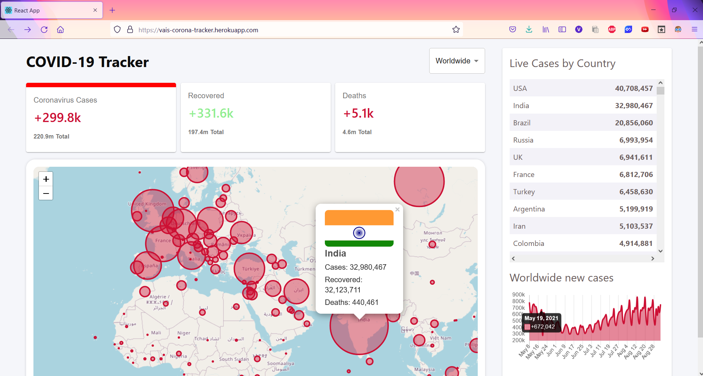
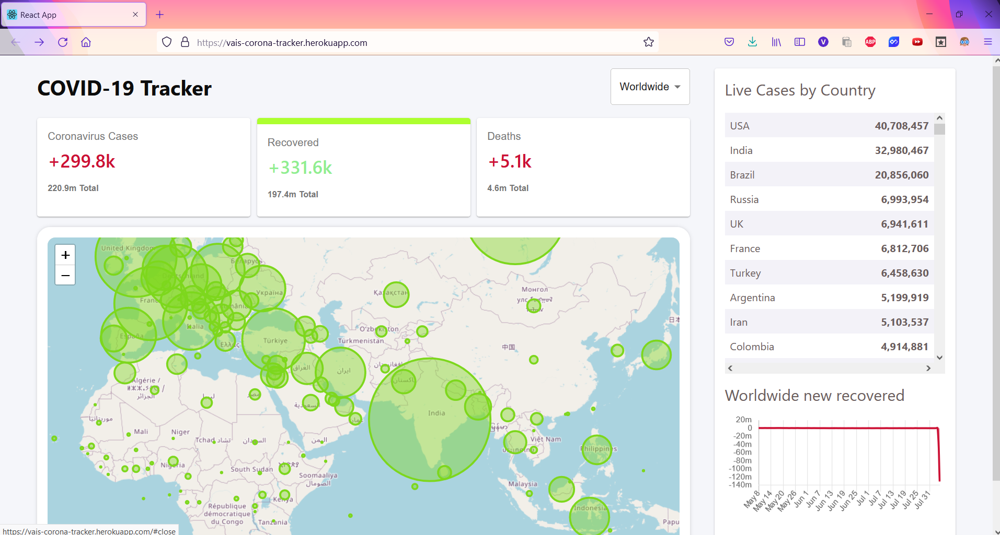
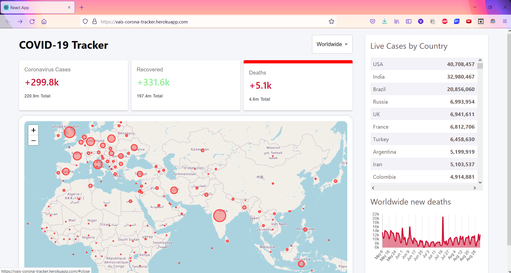

# COVID-19 Tracker

The web app displays total number of new cases, recovered cases and deaths in the world. The countries are arranged in terms of most number of cases in the Table. 
The user can select a country from the drop down list to get an overview of the covid situation there. Data is visualised on a line graph according to the selection made:Cases,Recovered,Deaths and circles are plotted respectively on the map.
The number of cases can be seen at each point of the graph and the country details popup on the map whenever you hover over it. 

## Built With
- ReactJs
- disease.sh API
- HTML
- CSS
- Material-UI
- Heroku

## Live Demo
[Live Demo Link](https://vais-corona-tracker.herokuapp.com/)

## Screenshots

